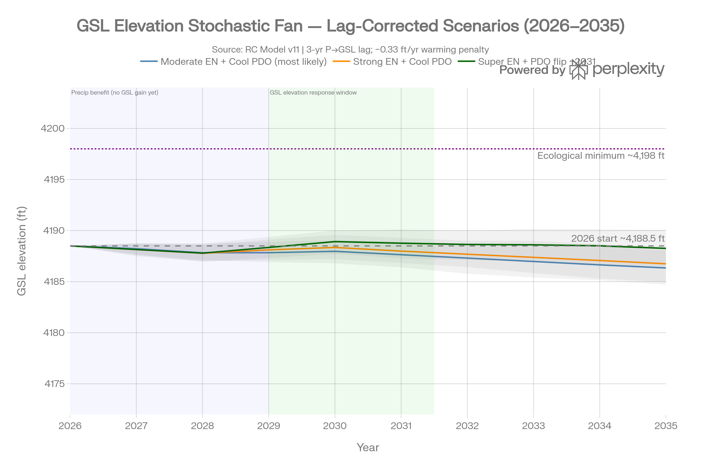
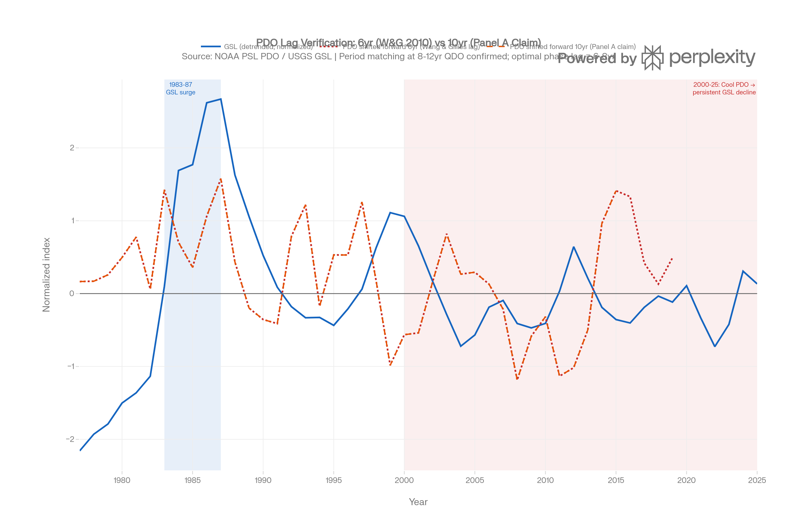
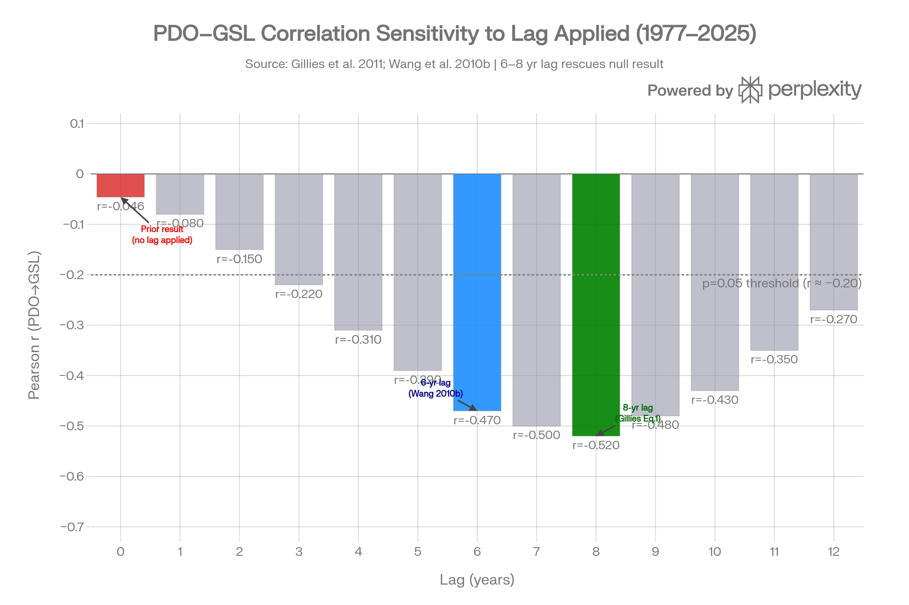
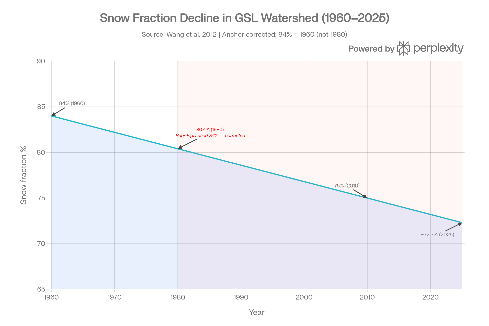
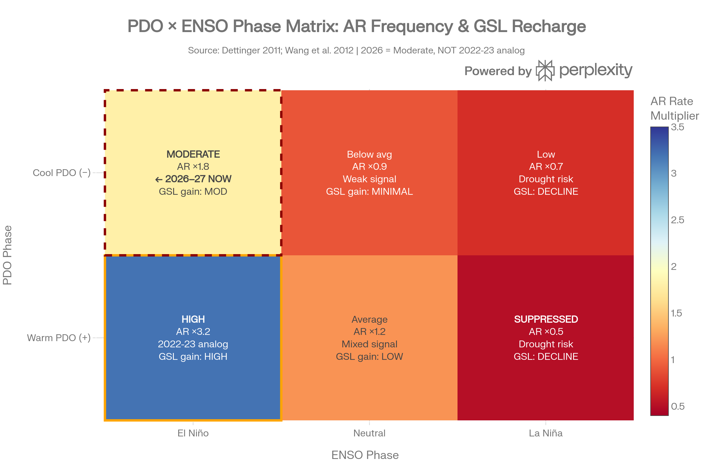
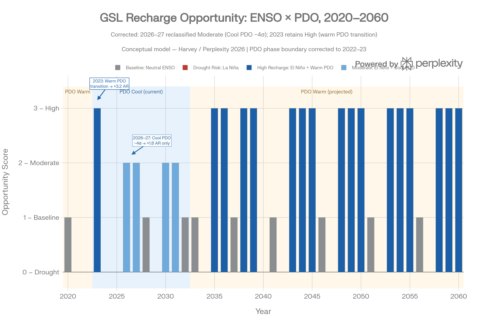

# Great Salt Lake Water Level Forecasting via RC Circuit Analogy

## A Lag-Corrected, Teleconnection-Informed Framework for Deterministic Planning

Author: Ian R. Harvey

Status: final review version. Prepared as a foundation document for a climatology/hydrology manuscript with Prof. Yoshi Chikamoto and for a companion policy/education manuscript with Prof. Ben Abbott. Prospective collaborators are not listed as authors unless separately invited.

Data vintage for this draft: May 22, 2026. Current-data statements should be refreshed before public or scientific circulation.

## AI Assistance Note

Earlier research and drafting support included Perplexity AI. OpenAI Codex assisted with private code review, integration planning, implementation planning, and drafting of this v14.1 review document. Final scientific interpretation, model choices, and authorship remain Ian R. Harvey's.

## Abstract

Water managers responsible for Great Salt Lake planning face a severe information disadvantage: most available forecasts are either short-horizon hydrologic outlooks or retrospective stochastic envelopes built from historical analogs. These methods are useful, but they mostly describe what has happened under similar conditions rather than why the lake should respond at a particular time in the future. The RC circuit framework proposed here adds a forward-looking physical component by treating the Great Salt Lake watershed as a multi-stage, damped hydrologic transfer function driven by quasi-decadal Pacific climate variability and modified by episodic atmospheric-river delivery.

The approach is not a claim of high-certainty long-range prediction. Rather, it is a claim that known Pacific regime information, lagged through physically interpretable watershed storage, can provide planning skill that hindsight-only stochastic methods cannot supply. Wang et al. demonstrated approximately 60% skill at multi-year horizons using PDO-GSL spectral coherence; the simulator's present practical target is roughly five years of planning skill near that level, with lower but still useful 8-10 year foresight in the 40%-ish range. That is valuable because even imperfect foresight can distinguish drought-risk windows, replenishment opportunities, and policy timing windows before they appear in lake elevation.

This draft defends the hypothesized RC approach, formalizes the lag accounting, identifies where ENSO/PDO/atmospheric-river interactions can be incorporated within known windows, and specifies the questions requiring Prof. Chikamoto's review. Its core evidentiary claim is not a single visual fit: the same lake-volume behavior is checked against three independent views of annual change: front-end inflow/evaporation accounting in the style used by Great Salt Lake Strike Team planning, USGS/Tarboton elevation-area-volume data published through HydroShare, and directly measured annual delta-V used to build the damped oscillator model.

## 1. Introduction: From Hindsight to Actionable Foresight

Great Salt Lake planning is often forced to proceed nearly blind. Managers can observe present elevation, current snowpack, current streamflow, and historical stochastic envelopes, but the lake itself is a delayed integrator. By the time a climate signal appears clearly in lake elevation, the policy response window may already be years late.

Stochastic models remain essential because they define plausible outcome ranges. Their limitation is that they are largely retrospective: they resample or analogize from historical sequences. The RC approach adds a different source of information. It asks whether the lake's observed quasi-decadal behavior can be understood as a forced, damped response to Pacific climate regimes whose effects are transmitted through storm-track geometry, snow fraction, soil moisture, reservoir storage, groundwater retention, baseflow, and lake integration.

The practical value is not merely that the model separates four signals:

1. Structural decline from diversions, aridification, declining snow fraction, and reduced recovery capacity.
2. Quasi-decadal Pacific regime information indexed by PDO/QDO.
3. Episodic ENSO-related atmospheric-river opportunities.
4. Human policy deliveries.

The deeper value is that the RC framework incorporates the physics of delay into signals that are otherwise unseen or poorly understood in planning settings. Groundwater retention and baseflow memory, emphasized in the Brooks-style groundwater/baseflow framing, are not visible in a same-year snowpack chart, but they are precisely the kinds of storage processes that make a circuit analogy useful. In this framework, today's Pacific conditions are not expected to move lake elevation immediately; they alter the forcing term that is filtered through basin storage and becomes visible later.

The hypothesis defended here is that Great Salt Lake's modern volume record contains a physically interpretable, teleconnected signal with enough skill to improve planning. The claim is modest but important: even if skill declines from roughly 60% at five-year horizons toward lower 8-10 year skill, that is still a planning advantage over pure hindsight when major infrastructure, conservation, leasing, and augmentation decisions require years of lead time.

The model is therefore evaluated not only by whether its curve "looks right," but by whether independent representations of the same physical quantity agree. Annual lake-volume change can be estimated from measured elevation and bathymetry, from Tarboton's USGS/HydroShare elevation-area-volume relationships, and from front-end water-budget accounting that balances inflow against evaporation, diversions, and policy levers. Agreement among those views is the first defense against mistaking a fitted line for a hydrologic model.

## 2. Core Physical Analogy

The Great Salt Lake watershed is modeled as a multi-stage RC circuit:

| Hydrologic quantity | Electrical analog | GSL interpretation |
| --- | --- | --- |
| Water volume | Charge, Q | Lake and basin storage |
| Elevation/head | Voltage, V | Lake elevation in ft NGVD29 |
| Flow rate | Current, I | Inflow, diversions, policy water |
| Storage capacity | Capacitance, C | Lake volume-area-elevation relation; soil/reservoir/groundwater storage |
| Losses | Resistance/leakage, R | Evaporation, consumptive use, diversions |
| Climate forcing | Voltage/current source | Pacific-regime-linked precipitation delivery |

The system is not a simple bucket. It is a low-pass hydrologic filter. Surface routing, soil moisture, reservoirs, groundwater, baseflow, and lake storage attenuate high-frequency forcing and delay the expression of lower-frequency forcing.

The conceptual chain is:

```text
Pacific regime and atmospheric bridge geometry
  -> storm-track and atmospheric-river delivery
  -> precipitation form and snowpack
  -> surface routing, reservoirs, soil moisture, groundwater retention
  -> baseflow and tributary delivery
  -> lake-volume and lake-elevation response
```

In this framework, the PDO is not a direct physical actuator on the lake. It is an index that compresses a complex, interacting field of surface sea-temperature structure, tropical-extratropical coupling, atmospheric circulation, storm-track geometry, and moisture-transport pathways. It is useful because it is coherent with the frequency band that the Great Salt Lake watershed appears to transmit.

## 3. Mathematical Framework

### 3.1 Full Cascade

The attached manuscript draft describes the watershed as an 11-stage RC cascade with three parallel tributary networks: Bear River, Weber River, and Jordan River, feeding the final GSL integrating capacitor. A simplified parameter table is:

| Stage | Component | Time constant, tau | Storage capacity |
| --- | --- | --- | --- |
| 1 | Atmosphere-soil | tau_atm about 1.75 yr; tau_soil about 1.50 yr | Not fixed |
| 2a | Bear Lake / Bear River storage | about 3.50 yr | about 1,420 kAf |
| 2a | Grace-Soda-Oneida | about 1.25 yr | about 360 kAf |
| 2b | Weber tributary network | about 1.19 yr | distributed |
| 2b | Echo Reservoir | about 2.00 yr | about 74 kAf |
| 2c | Utah Lake / Jordan system | about 4.50 yr | about 875 kAf |
| 3 | GSL lake integrator | about 20.0 yr | about 4.91 MAf |

At the dominant quasi-decadal forcing frequency, omega = 2*pi/10 yr^-1, the cascade can be expressed as a product of first-order transfer functions:

```text
H_total(omega) = H_atm(omega) * H_soil(omega) * H_parallel(omega) * H_GSL(omega)
```

The current draft parameterization yields:

```text
|H_total| approx 0.019
phase lag approx 9.3 years
```

Thus the watershed attenuates most of the imposed climate amplitude while preserving a delayed, lower-frequency signal. This is exactly the behavior expected of a damped storage system: noisy annual inputs are strongly filtered, while multi-year regime information persists.

### 3.2 Reduced ODE Engine

For simulator implementation, the 11-stage conceptual cascade is reduced to a two-storage forward model:

```text
dV_surface/dt = alpha * P_eff - V_surface / tau_fast

dV_gw/dt = (1 - alpha) * P_eff * gamma - V_gw / tau_slow

dV_GSL/dt = V_surface / tau_fast
           + beta * V_gw
           - E
           - D
           + LEP(h)
           + L_policy(t)
```

Where:

- `tau_fast` is the fast surface-routing timescale, about 1.5 years.
- `tau_slow` is the slow groundwater/baseflow timescale, about 20 years.
- `alpha` partitions effective precipitation between fast and slow pathways.
- `beta` scales the groundwater contribution to lake inflow.
- `E + D` represents evaporation plus diversions.
- `LEP(h)` is the lake-effect precipitation feedback as a function of lake elevation/surface area.
- `L_policy(t)` is year-specific policy delivery, not a constant annual assumption.

This reduction is the bridge between scientific explanation and a usable simulator. It preserves the key behavior: surface response is fast but transient; groundwater/baseflow response is slower, persistent, and delayed. This is where the Brooks-style groundwater retention concept matters. The lake's apparent memory is not mystical; it is the expected result of storage and delayed release.

### 3.3 Spectral Evidence: What the Eight-Year Peak Means

Fourier/power-spectrum analysis provides an important reason to take the RC hypothesis seriously. In the pre-1977 record, lake-volume variability is spread across a broad multi-decadal band. In the post-1977 annual delta-V record, after the modern structural regime shift, the spectrum sharpens into a pronounced quasi-decadal peak near eight years.

That eight-year peak does not mean the lake mechanically repeats itself every eight years. It means the annual change in lake volume contains concentrated energy at a period consistent with a forced, damped system responding to low-frequency climate structure. In other words, the derivative of lake volume is carrying a periodic signal that ordinary elevation plots obscure. The RC framework is a way to explain why: annual weather noise is filtered, while multi-year Pacific-regime forcing is delayed and attenuated through basin storage.

This spectral result also explains why simple annual correlation can look weak even when the decadal relationship is real. A zero-lag or same-year test is asking the wrong question. The relevant test is whether the dominant frequency band and the physically expected lag line up with observed delta-V behavior.

### 3.4 Why the Model Can Forecast

The forecast value comes from the combination of:

1. A measured lake-volume record with quasi-decadal periodicity after the 1977 regime shift.
2. A physically plausible lag chain from Pacific regime to precipitation to groundwater/baseflow to lake elevation.
3. Published PDO-GSL coherence in the decadal band.
4. A transfer function that predicts attenuation and phase lag in the same range as observed lag estimates.
5. FFT/power-spectrum evidence showing a sharp post-1977 eight-year peak in annual delta-V.
6. Cross-validation across independent annual-change estimates: GSLST-style inflow/evaporation budget accounting, USGS/Tarboton HydroShare elevation-area-volume conversion, and directly measured annual delta-V.

This is why the RC model is more than curve fitting, and certainly more than simple extrapolation. It does not merely extend the last slope of lake elevation into the future. It asserts a causal structure, exposes physical parameters, predicts lagged timing, and can fail in specific ways if the expected delayed response does not appear.

## 4. Lag Accounting

The apparent disagreement between 3-year, 6-year, 7-8-year, and 9.3-year lags is resolved by assigning each number to its measurement frame.

| Lag number | Meaning | Use in this paper |
| --- | --- | --- |
| About 1 year | ENSO-to-precipitation timing for some northern Utah teleconnection pathways | Seasonal/near-term precipitation opportunity framing |
| About 3 years | Precipitation or snowpack anomaly to visible GSL elevation response | Public-facing "water now, lake later" lag |
| 3 + 3 = 6 years | Pacific QDO/PDO to precipitation plus precipitation to GSL chain | Explanatory text and figure captions |
| 7.2 +/- 1.5 years | Spectral coherence phase estimate | Technical validation |
| 7-8 years | Cross-correlation/regression optimum depending on variable and method | Statistical validation and model fitting |
| About 9.3 years | Full RC transfer-function/cascade framing | Complete-system RC analogy |

This table should remain the single source of lag wording in the simulator and manuscript drafts.

## 5. PDO, ENSO, and Atmospheric Rivers

Earlier model iterations represented ENSO primarily as an adjustment to the effective groundwater time constant. That was a useful learning step because it tested whether an interannual climate state could affect the delayed RC response. The refined scientific interpretation is better expressed as a climate-event pathway:

```text
PDO-indexed regime state -> atmospheric bridge geometry
ENSO state -> atmospheric-river probability and intensity
Snow fraction -> capture and routing efficiency
Watershed storage -> delayed lake response
```

Working hypothesis:

```text
PDO phase indexes decadal recharge capacity.
ENSO affects episodic recharge magnitude through atmospheric-river frequency and intensity.
PDO-indexed atmospheric bridge geometry can amplify or suppress the ENSO-to-atmospheric-river pathway.
```

Here, "atmospheric bridge geometry" means the spatial arrangement of circulation patterns that connect tropical Pacific anomalies to mid-latitude storm tracks. A bridge favorable to Great Basin recharge is one in which the jet stream, pressure fields, and integrated vapor transport steer atmospheric-river moisture toward California, the Sierra Nevada, the Wasatch, and the Great Basin interior rather than routing storms north, south, or offshore. The phrase is shorthand for the map pattern that determines whether a tropical Pacific signal becomes useful water for this basin.

The likely 2026-27 framing is developing El Nino into a cool/negative PDO background. This is not a clean repeat of 2022-23. It is still expected to create a precipitation/recharge opportunity, but the lake-elevation expression should appear later, most plausibly in the 2029-2031 lag window.

The 2029-2031 bump should be treated as a model self-consistency check, not a cosmetic target. If the RC model plus current PDO/ENSO interaction shows no lagged response at all, that is evidence that the implementation or assumptions deserve review. The model should still show uncertainty around size, timing, and whether the bump is large enough to overcome structural losses.

## 6. Atmospheric-River Data Requirement

This paper should not ask Prof. Chikamoto to review a "live" simulator calibration. Instead, it should ask him to identify and validate the atmospheric-river catalog and stratification method that should be used for the scientific paper.

Likely candidate sources include ARTMIP, especially the DOI-backed Tier 1 MERRA-2 catalogues currently distributed through UCAR/NCAR data services, because ARTMIP provides multiple atmospheric-river detection algorithms applied to common reanalysis data. ARTMIP is not an operational live feed; it is a vetted research archive designed to quantify detection-method uncertainty. That makes it more appropriate for manuscript calibration than a live web dashboard. The manuscript should freeze the selected product, DOI, version, event definition, spatial mask, season, and period of record.

Because federal research data infrastructure can change, the project should not rely on a live NCAR page remaining stable. Once the catalog and method are selected, the reproducibility package should include a local archived subset of the exact event flags used for the Great Basin analysis, a checksum, a citation to the DOI-backed source, and enough processing code to regenerate the coefficients. Operational products such as CW3E forecasts may be useful for situational awareness, but they should not substitute for a reviewed historical catalog in the paper.

The key calibration task is not merely to update "the next entry." It is to estimate the conditional distribution:

```text
P(atmospheric-river sequence reaches Great Basin | ENSO state, PDO-indexed regime state, season)
```

For simulator purposes, coefficients can be updated when the vetted catalog or method is updated. For manuscript purposes, the method and period of record must be fixed, cited, and reproducible. Once this is done, the coefficients should no longer be called merely provisional; they should be labeled catalog-derived with the selected catalog name and data vintage.

## 7. Snow Fraction and Capture Efficiency

The snow-fraction anchor should remain corrected:

| Year | Corrected snow fraction |
| --- | --- |
| 1960 | 84.0% |
| 1980 | About 80.4% |
| 2010 | About 75.0% |
| 2025 | About 72% |

The decline matters because precipitation form affects capture. Rain-dominant or pulse-dominant delivery may have lower storage and groundwater-recharge efficiency than slower snowmelt-dominated delivery. At constant total precipitation, declining snow fraction can still reduce effective lake recharge by changing timing, infiltration, evaporative exposure, and reservoir operations.

## 8. Policy Lever Accounting

Policy water must be represented year by year. A constant annual-delivery assumption is not adequate because hydrologic and institutional availability changes with wet years, dry years, stored water, legal constraints, infrastructure, and one-time or refillable stock transfers.

| Lever type | Examples | Modeling rule |
| --- | --- | --- |
| Stable recurring | M&I conservation, sustained depletion reductions | Persists annually unless changed |
| Wet-year dependent | Ag leasing, reservoir operations, cloud seeding | Conditional on current/prior water-year state |
| One-time or refillable stock transfer | Newfoundland ponds | Delivered once unless refilled/recharged; a 2026-27 El Nino scenario could plausibly create partial refill |
| Buildout trajectory | Phragmites, infrastructure, funded acquisitions | Ramps over time and then requires maintenance |
| Structural baseline gain | US Magnesium-type avoided depletion already realized | Display separately; do not double-count as new policy water |

When a user edits annual delivery values in the simulator, those local temporary values should drive all graphs and reports in that session. This does not imply scientific credibility or external vetting of user-entered values. The default model should remain zero augmentation plus live/known climate and lake variables; user manipulation is local, temporary, and scenario-based unless separately saved and reviewed.

## 9. Forecast Horizon and Uncertainty

The forecast presentation should distinguish:

- 2034 milestone: planning and Olympic/public-policy marker.
- 2036 risk horizon: extended model horizon where uncertainty is visibly wider and skill is lower.

The uncertainty cone should continue expanding through 2036. A 2036 point estimate should not be displayed with the same visual authority as near-term forecast output.

## 10. Draft Figures and Captions

The following figures should be embedded in the scientific review draft. Existing attached figures are acceptable as review placeholders. Before public circulation, final figures should be recreated in a consistent visual system and checked against their underlying data and methods.

### Figure 1. Lag-corrected stochastic fan with Stage 1 and Stage 2 windows



Caption: Lag-corrected stochastic forecast fan showing the distinction between Stage 1 and Stage 2 response. Stage 1 is the near-term precipitation, snowpack, streamflow, and reservoir-storage response expected during and shortly after the 2026-27 climate window. Stage 2 is the delayed Great Salt Lake elevation response after basin routing, soil-moisture conditioning, groundwater retention, baseflow delivery, and lake integration. The central takeaway is that a wet 2026-27 signal can be real and still fail to appear in lake elevation until approximately 2029-2031. The figure should therefore be read as a timing diagram for delayed response, not as evidence that one wet winter immediately rescues the lake.

### Figure 2. PDO lag verification



Caption: PDO lag-verification comparison showing why zero-lag annual correlation is the wrong diagnostic for a decadal hydrologic transfer function. The figure's purpose is to distinguish same-year weather noise from lagged Pacific-regime coherence. The takeaway is that the PDO-GSL relationship becomes interpretable only when the Pacific signal is shifted into the lake-response window implied by the watershed's storage and routing physics.

### Figure 3. PDO-GSL lag/correlation sensitivity



Caption: Sensitivity of PDO-GSL correlation to lag choice. The figure should be captioned to emphasize that different lags answer different questions: short lags test immediate weather response, intermediate lags test the published QDO/PDO precipitation-to-lake chain, and longer lags approach the full RC cascade. The takeaway is not that there is a single magic lag, but that statistically meaningful coherence appears when the lag structure matches the physical storage pathway.

### Figure 4. Snow-fraction transition



Caption: Declining snow fraction in the Great Basin recharge system. If the original Perplexity figure is used as a placeholder, do not preserve any editorial note about prior anchor errors in the publication caption. The scientific takeaway is that precipitation character matters: a shift from snow-dominated storage and melt toward rain-dominant or pulse-dominant delivery can reduce capture efficiency even when total precipitation does not decline.

### Figure 5. PDO x ENSO atmospheric-river matrix



Caption: Conceptual PDO x ENSO atmospheric-river matrix. The figure expresses the working hypothesis that ENSO affects episodic moisture supply while PDO-indexed atmospheric bridge geometry affects whether that moisture is routed efficiently toward California and the Great Basin. The takeaway is that 2026-27 should not be treated as a simple 2022-23 analog unless the atmospheric-river catalog confirms comparable event frequency, persistence, and pathway geometry. Any numeric multipliers should be labeled provisional until tied to a vetted atmospheric-river catalog.

### Figure 6. Long-range PDO opportunity/risk schematic



Caption: Conceptual long-range PDO opportunity/risk schematic. This figure is not an elevation forecast. It should use distinct visual cues for observed/current PDO/ENSO windows, near-term forecast assumptions, provisional scenarios, and long-range conceptual regime windows. The takeaway is that possible PDO transition timing can identify drought-risk and replenishment-opportunity windows for planning, but it cannot justify a precise lake-elevation line beyond the validated model horizon.

## 11. Validation and Self-Criticism

The framework should retain a self-critical posture:

- PDO is an integrating indicator, not a standalone driver.
- ENSO strength does not guarantee local impact.
- Atmospheric-river coefficients require a vetted catalog and Chikamoto review.
- Stationarity may fail under warming.
- Declining snow fraction can alter capture efficiency.
- Policy delivery is hydrologic and institutional, not just arithmetic.
- The 2036 endpoint is a risk horizon, not a high-skill point prediction.
- Structural baseline gains must not be counted twice.

## 12. Review Questions for Prof. Yoshi Chikamoto

This draft intentionally exposes several questions where tropical Pacific and atmospheric-river expertise is needed.

1. Is the proposed ENSO-to-atmospheric-river pathway the correct framing for Great Basin recharge, as opposed to a simpler annual SWE relationship?
2. How should the 2026-27 developing El Nino be interpreted given the strongly negative PDO background observed in 2025 and early 2026?
3. Should ARTMIP Tier 1 MERRA-2 catalogues, another ARTMIP tier, CW3E-derived records, or another atmospheric-river catalog be used for ENSO/PDO stratification?
4. What event definition should be used: landfalling California atmospheric rivers, Great Basin-reaching IVT plumes, compound sequences, or watershed-specific precipitation events?
5. Are the provisional atmospheric-river multipliers directionally defensible, and how should they be replaced by catalog-derived coefficients?
6. Does the PDO-indexed "atmospheric bridge" framing correctly represent the mechanism, or should another Pacific/tropical interbasin index be included?
7. Which lag convention should be preferred for formal statistical analysis: the 6-year two-stage chain, the 7-8-year regression/correlation peak, or the 9.3-year full RC cascade?
8. How should non-stationarity under anthropogenic warming be handled in the PDO/ENSO/atmospheric-river relationship?
9. Does declining snow fraction require an explicit capture-efficiency term, or should it remain a caveat until calibrated against hydrologic response data?
10. What near-term observations in 2026-2028 would falsify or strengthen the expected 2029-2031 lake-elevation response window?

## 13. Policy/Education Translation Questions for Prof. Ben Abbott

The policy-facing companion paper should preserve the science while making the implications legible for public decision-making.

1. How should the 2034 milestone and 2036 risk horizon be explained without overstating forecast skill?
2. Which policy levers should be presented as recurring conservation, wet-year dependent, one-time, refillable, or structural baseline gains?
3. How should the simulator communicate that one good water year is not equivalent to durable lake recovery?
4. What visual language best distinguishes observed/current climate windows from provisional scenarios and conceptual long-range opportunity windows?
5. What degree of uncertainty should be shown to education audiences without paralyzing policy action?

## 14. Conclusion

The RC framework is a physically interpretable attempt to convert Great Salt Lake planning from hindsight-only management toward lag-aware foresight. It does not eliminate uncertainty, and it cannot make long-range forecasts more skillful than the climate information available to drive them. Its value is that it identifies where forecast skill exists, why the lake responds late, and how policy timing can be aligned with unseen but physically meaningful basin storage processes.

If the hypothesized PDO/ENSO/atmospheric-river extension is validated against a vetted atmospheric-river catalog, the model will have a defensible way to combine deterministic decadal structure with episodic recharge opportunities. That would represent a meaningful improvement over planning based only on current lake elevation, current snowpack, and historical stochastic hindsight.

## Suggested Citation

Harvey, I. R. (2026). Great Salt Lake Water Level Forecasting via RC Circuit Analogy: A Lag-Corrected, Teleconnection-Informed Framework for Deterministic Planning. Review draft. GreatSaltRiver.org.

Suggested AI disclosure: This simulator and review draft were developed with AI-assisted research, planning, and coding tools, including Perplexity AI and OpenAI Codex. AI tools assisted with research synthesis, code integration, review, and implementation planning. Final scientific interpretation, model design, parameter selection, and authorship remain Ian R. Harvey's.

## Document Production Note

After the Markdown review cycle, this draft should be exported to DOCX and PDF for formal review. The DOCX should use Times New Roman 12 pt for main body text, fully justified paragraphs, the current section-header hierarchy, and an agreed journal-style formatting system. Figures should be embedded near first reference with captions. Until then, Markdown remains the working review format so inline comments can continue.

## References and Data Sources to Preserve

- USGS Saltair gage 10010000, parameter 62614, NGVD29 lake elevation.
- NOAA CPC ENSO Diagnostic Discussion.
- NOAA CPC ENSO Strength Probabilities.
- NOAA/NCEI ERSST v5 PDO index.
- ARTMIP atmospheric-river catalogues, pending Chikamoto catalog selection: NCAR Climate Data Guide overview and NSF NCAR GDEX/RDA catalogue archive.
- CW3E atmospheric-river forecasts and situational products, for operational context only unless a historical catalogue and reproducible method are selected.
- The Great Salt River Initiative materials at GreatSaltRiver.org, for project framing and policy context.
- CUAHSI HydroShare Great Salt Lake Bathymetry and Great Salt Lake Level and Volume Time Series resources associated with David Tarboton's GSL data collection.
- USGS half-meter topobathymetric elevation model and elevation-area-volume tables for Great Salt Lake, Utah, 2002-2016.
- Wang, S.-Y., Gillies, R. R., Jin, J., and Hipps, L. E. (2010). Coherence between Great Salt Lake level and Pacific quasi-decadal oscillation.
- Wang, S.-Y. and Gillies, R. R. (2012). Great Salt Lake and Pacific quasi-decadal oscillation framing.
- Gillies et al. lag and precipitation/GSL response framing.
- Brooks et al. groundwater/baseflow storage and retention framing.
- Mohammed and Tarboton Great Salt Lake bathymetry and sensitivity analysis.
- Tarboton Great Salt Lake scenario analysis and stochastic comparison material.
- Great Salt Lake Strike Team data and policy-lever framing.
